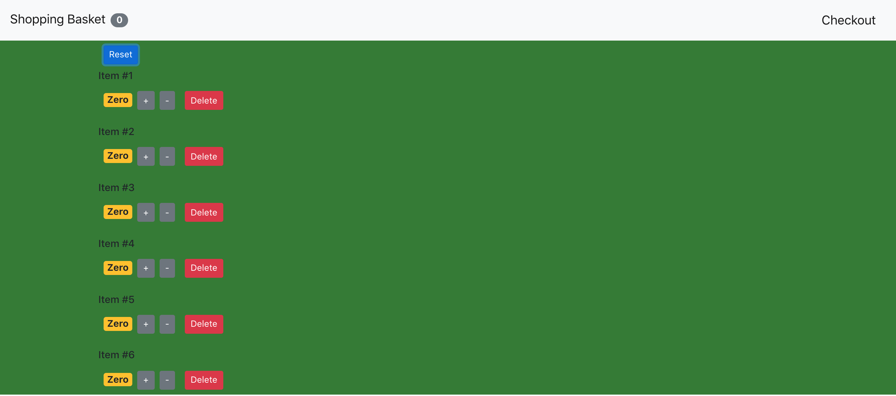

# Shopping Tracker App

After finishing my first react app ([_Tic Tac Toe_](https://github.com/davidpaps/tic_tac_toe)), I decided to experiment further with this amazing JavaScript library. This is a program that can be added to any ecommerce website. It is a shopping tracker that is present on a website where a user can add items to their basket and modify.

---

## Functionality

- Add multiple of the same item
- Subtract a given number of the same items
- Delete the item altogether from the inventory
- Reset the numbers to Zero of every item
- Navigation bar at the top displays the number of unique items in the basket

---

## How To Run

Clone this repo, navigate to `shopping_tracker` and in the command line type:

```
npm install
```

This will install the necessary dependancies. To run, in the command line type:

```
npm start
```

Then visit [_localhost:3000_](http://localhost:3000/) to view the shopping tracker!

---


